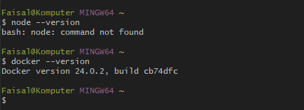
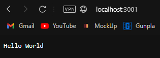

## Creating a Simple Node.js App inside Docker

### Step 1: Install Docker

1. Install Docker on Windows:
2. Visit the [Docker Desktop](https://www.docker.com/products/docker-desktop) for Windows page.
3. Download the installer and run it.
4. Follow the installation wizard instructions.
5. Once the installation is complete, Docker Desktop will be running in the background, indicated by the Docker icon in the system tray.



### Step 2: Set up the Node.js Application
Create a new directory for your Node.js application and navigate into it. Inside the directory, create a file named `app.js` and add a simple Node.js application code. For example:

```javascript
// app.js
const http = require('http');

const hostname = '0.0.0.0';
const port = 3001;

const server = http.createServer((req, res) => {
  res.statusCode = 200;
  res.setHeader('Content-Type', 'text/plain');
  res.end('Hello World');
});

server.listen(port, hostname, () => {
  console.log(`Server running at http://${hostname}:${port}/`);
});
```

### Step 3: Create a Dockerfile
In the same directory as your `app.js`, create a file named `Dockerfile` (no file extension). This file will contain the instructions for building the Docker image.

```Dockerfile
# Use the official Node.js image as the base image
FROM node:latest

# Set the working directory inside the container
WORKDIR /week-6-rz0u

# Copy package.json and package-lock.json to the working directory
COPY package*.json ./

# Install app dependencies
RUN npm install

# Copy the rest of the application files to the working directory
COPY . .

# Expose the port the app is running on
EXPOSE 3001

# Command to run your Node.js app
CMD ["node", "app.js"]
```

### Step 4: Write a package.json File
The `package.json` file is used to manage dependencies and define scripts for your Node.js application. Create a new file named `package.json` in the same directory as your `app.js` and define the content as follows:

```json
{
    "name": "node docker",
    "version": "1.0.0",
    "description": "Dockerize Node.JS for week 6 assignment",
    "main": "app.js",
    "scripts": {
      "start": "node app.js"
    },
    "author": "rz0u",
    "license": "ISC",
    "dependencies": {
      "http": "^0.0.1-security"
    }
  }
```

### Step 5: Build the Docker Image
Open a terminal, navigate to the directory containing your `Dockerfile`, and run the following command to build the Docker image:

```bash
docker build -t week-6-assignment .
```

Note: `week-6-assignment` is the name you give to your Docker image. Don't forget the period at the end of the command; it specifies the build context (the current directory).

### Step 6: Run the Docker Container
After building the Docker image, you can create and run a Docker container from it:

```bash
docker run -p 3001:3001 week-6-assignment
```

The `-p` flag maps port 3001 from the host to port 3001 in the container.

### Step 7: Test the Application
Once the container is running, you can access your Node.js app by opening a web browser or using `curl` in the terminal:

```bash
curl http://localhost:3001
```

You should see the response from your Node.js app: "Hello World"



That's it! You've successfully created a simple Node.js app inside a Docker container.